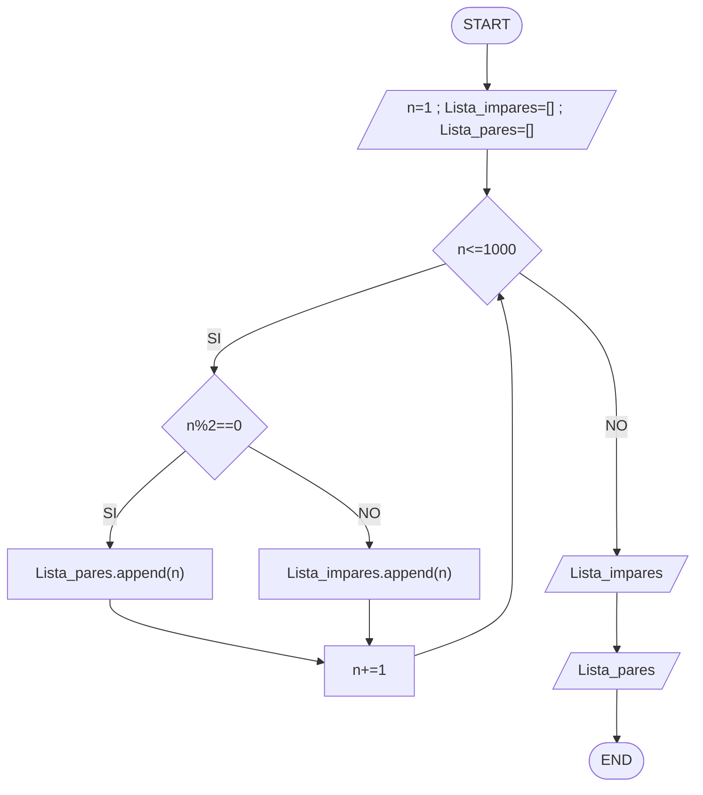
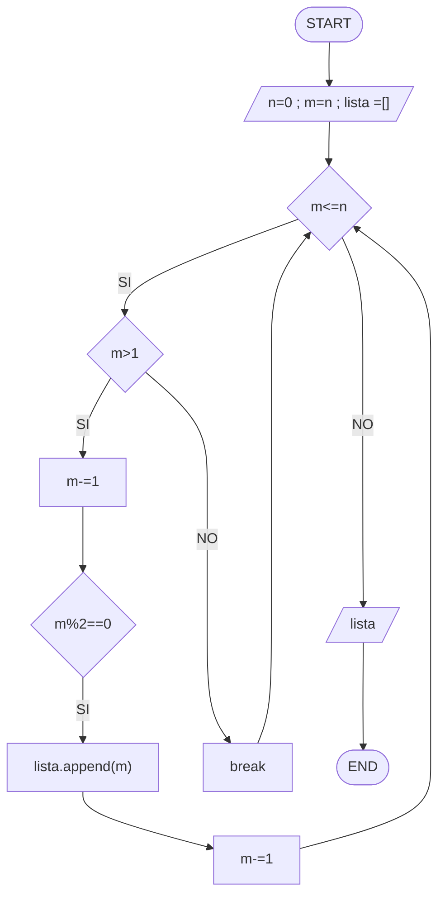

# Reto número 7 repo
### Fecha:  02-10-2023
### Link notebook: https://colab.research.google.com/drive/1fZk8OSnmX8CliyDd8knGgl5fd1s4yO7P?usp=sharing , mirar archivo Reto_7.ipynb
**1.** Imprimir un listado con los números del 1 al 100 cada uno con su respectivo cuadrado.
* Para este problema primero definí mis variables n=1 ya que el listado debe comenzar desde 1 y, una lista vacía donde se van a ir incluyendo los cuadrados de los número.

  Creé un while, el cuál funcionará mientras n sea menor o igual a 100 (por el enunciado). Dentro de este, se calcula el cuadrado del número y el resultado se añade a la lista. Además, a la variable n se le sumará 1 para que de esta forma el código continue realizando el proceso del while con el siguiente número.

  Cuando la condición del while ya no se cumpla más, significa que el programa ya tendrá todos los cuadrados de los números desde 1 hasta 100 y el programa imprimirá la lista.
  
* Diagrama de flujo:

* Mirar archivo Punto_1.py
```pseudocode
n= 1
Lista=[]

while n <= 100:
  cuadrado = n**2
  Lista.append(cuadrado)
  n += 1
  
print(Lista)
```
**2.** Imprimir un listado con los números impares desde 1 hasta 999 y seguidamente otro listado con los números pares desde 2 hasta 1000.
* Para este problema primero definí mis variables n=1 ya que el listado debe comenzar desde 1, una lista vacía donde se van a ir incluyendo los números impares (Lista_impares), y una lista vacía que tendrá los números pares (Lista_pares).

  Creé un while, el cuál funcionará mientras n sea menor o igual a 1000 (por el enunciado). Dentro de este, hay un condicional if: n%2==0, que se usa para determinar si el número es par o impar, en caso de ser verdadera la condición el número se añadirá a la lista de pares, en el caso contrario, en la lista de impares. Después de añadir el número a la lista correspondiente, se le sumará a n una unidad (1) para evaluar el siguiente número.

  Cuando la condición del while ya no se cumpla más, significa que el programa ya tendrá clasificado todos los números desde 1 hasta 1000 y el programa imprimirá la lista tanto de los número impares como los pares.
  
* Diagrama de flujo:

* Mirar archivo Punto_2.py
```pseudocode
n = 1
Lista_impares=[]
Lista_pares=[]

while n <= 1000:
  if n%2==0:
    Lista_pares.append(n)
  else:
    Lista_impares.append(n)
  n += 1
  
print("Los números impares: " + str(Lista_impares))
print("Los números pares: " + str(Lista_pares))
```
**3.** Imprimir los números pares en forma descendente hasta 2 que son menores o iguales a un número natural n ≥ 2 dado
* Para este problema primero le solicité al ususario ingresar el número n, definí mis variables m=n, una lista donde se van a ir incluyendo los números pares.

  Creé un while, el cuál funcionará mientras m<=n (solo se quieren calcular en ese rango). Dentro de este, hay un condicional en el cual si m>1 (se desea calcular solo hasta el número 2, en caso de ser negativo, mediante el uso de un breake, se volverá a evaluar el while) se evaluará otro condicional donde si m%2==0 significa que el número es par y por esta razón, se añadirá a la lista el elemento m. Despues, se le restará una unidad a la variable m para continuar con el siguiente número de manera descendente.

  Cuando la condición del while ya no se cumpla más, significa que el programa ya tendrá clasificado todos los números pares desde n hasta 2 y el programa imprimirá la lista de estos.
* Diagrama de flujo:

* Mirar archivo Punto_3.py
```pseudocode
n = int(input("Ingrese un número mayor o igual a 2: "))
m=n
lista = []

while m<=n:
  if m>1:
    if m%2==0:
      lista.append(m)
    m -= 1
  else:
    break
print("Los números pares desde n hasta 2 son: " + str(lista))
```
**4.** En 2022 el país A tendrá una población de 25 millones de habitantes y el país B de 18.9 millones. Las tasas de crecimiento anual de la población serán de 2% y 3% respectivamente. Desarrollar un algoritmo para informar en que año la población del país B superará a la de A.
* Para este problema primero le solicité al ususario ingresar el año en el que se encuentra, definí las variables A y B correspondientes a la cantidad de habitantes inicial. 

  Creé un while, el cuál funcionará mientras B<=A (ya que cuando no se cumpla B ya habrá superado a A). Dentro de este, se realizan los calcuos del aumento del 2% y el 3% de cada población y se le suma al valor inicial. Se suma a la variable del tiempo en años 1 año para continuar con el crecimiento poblacional evaluado en while.

  Cuando la condición del while ya no se cumpla más, significa que la población B ya superó la población de A y el programa imprimirá el año en el cual estas cifras pasarán.
* Mirar archivo Punto_4.py
```pseudocode
A = 25000000
B = 18900000
tiempo = int(input("Ingrese el año de inicio:"))

while B <= A:
    crecimientoA = (A * 2) / 100
    crecimientoB = (B * 3) / 100
    A += crecimientoA
    B += crecimientoB
    tiempo += 1

print("Para el año " + str(tiempo) + " la población del país B superará a la de A")
```
**5.** Imprimir el factorial de un número natural n dado.
* Para este problema primero le solicité al ususario ingresar el numero entero n al cuál se le quiere calcular el factorial, y creé la variable factorial.

  Creé un while, el cuál funcionará mientras n>0. Dentro de este, se realizan los calcuos del factorial multiplicando el valor de esta variable con el número n, cada vez que se realice este proceso se le restará a n una unidad para que en el factorial se multiplique por el siguiente número en orden descendente. 

  Cuando la condición del while ya no se cumpla más, significa que ya se han multiplicado los números para hallar el factorial, el programa imprimirá el resultado.
* Mirar archivo Punto_5.py
```pseudocode
n = int(input("Ingrese un número natural:"))
factorial = 1

while n > 0:
  factorial *= n
  n -= 1

print("El factorial del número es: " + str(factorial))
```
**6.** Implementar un algoritmo que permita adivinar un número dado de 1 a 100, preguntando en cada caso si el número es mayor, menor o igual.
* Para este problema primero le solicité al ususario ingresar el numero entero n que debe adivinar el programa, y creé la variable min y max para establecer los límites del número, una bandera para controlar el flujo, e importe la función "random".

  Creé un while, el cuál funcionará mientras la bandera sea positiva. Dentro de este, el programa usando "random" eligirá un número y se le preguntará al usuario que tipo de relación tiene este con el ingresado, si es menor, mayor o igual. Incluí un condicional donde se evalua las respuestas del usuario, si la respuesta es mayor, el rango de min se cambiará por el número random dado más una unidad ya que si es mayor se pueden descartar todos los demás números; si la respuesta es menor, por el contrario, será la variable max la que se cambiará por el número random dado menos una unidad; si la respuesta es igual habrá mun break en el while.

  Cuando la condición del while ya no se cumpla más, significa que el programa ya ha encontrado el número ingresado, el programa imprimirá el número.
* Mirar archivo Punto_6.py
```pseudocode
import random 
n = int(input("Ingrese un número:"))
min = 1
max = 100
bandera : bool = True
while bandera == True:
  n_random=random.randint(min, max)
  pregunta = input("El número es mayor, menor, o igual que: " + str(n_random) + " ")
  if pregunta == "mayor":
    min = n_random + 1
  elif pregunta =="menor":
    max = n_random - 1
  else:
    break
print("El número es: " + str(n_random))  
```
**7.** Implementar un programa que ingrese un número de 2 a 50 y muestre sus divisores.
* Para este problema primero le solicité al ususario ingresar el numero entero n entre 2 y 50, definí mi varieble divisor y, creé una lista de divisores vacía.

  Creé un while, el cuál funcionará divisor<=n (ya que el número no puede tener divisores mayores que él. Dentro de este, hay un condicional donde si n%divisior==0 significa que si es divisor y por lo tanto se añadirá a la lista de divisores (.append), de lo contrario, no se añadirá. Despues, se le sumará una unidad a la variable divisor para evaluar el siguiente número en el while.

  Cuando la condición del while ya no se cumpla más, significa que ya no hay más posibles divisores del número n y, el programa imprimirá la lista de divisores.
* Mirar archivo Punto_7.py
```pseudocode
n = int(input("Ingresar un npumero de 2 a 50:"))
divisor = 1
Lista_divisores=[]

while divisor <= n:
  if n % divisor == 0:
    Lista_divisores.append(divisor)
    divisor += 1
  else:
    divisor += 1

print(Lista_divisores)
```
**8.** Implementar el algoritmo que muestre los números primos del 1 al 100. Nota: use funciones
* Primero creé una función para encontrar los números primos. Dentro de esta función use un while que funcionará mientras el numero sea menor que 100 (por el enunciado)


* Mirar archivo Punto_8.py
```pseudocode
def EncontrarNumerosPrimos(numero: int, m: int, c: int) -> int:
  while numero < 100:
    numero += 1
    m = 1
    c = 0
    while m <= (numero**0.5):
      if numero%m==0:
        c += 1
      m += 1
    if c == 1:
      lista.append(numero)
  return lista
if __name__ == "__main__":
  numero: int = 1
  m: int = 1
  c: int = 0
  lista=[]
  num_primo = EncontrarNumerosPrimos(numero, m, c)
  print(num_primo)
```
