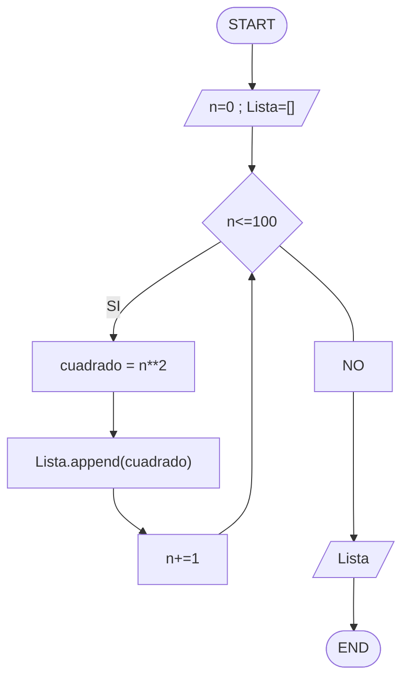
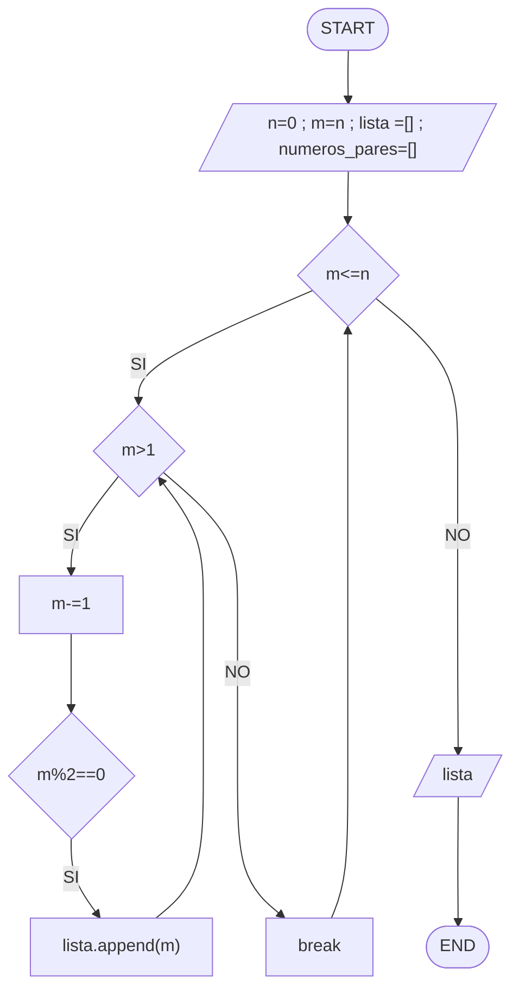

# Reto número 7 repo
### Fecha:  02-10-2023
### Link notebook: https://colab.research.google.com/drive/1fZk8OSnmX8CliyDd8knGgl5fd1s4yO7P?usp=sharing
**1.** Imprimir un listado con los números del 1 al 100 cada uno con su respectivo cuadrado.
* EXPLICACION
* Diagrama de flujo:

* Mirar archivo Punto_1.py
```pseudocode
n= 1
Lista=[]

while n <= 100:
  cuadrado = n**2
  Lista.append(cuadrado)
  n += 1
  
print(Lista)
```
**2.** Imprimir un listado con los números impares desde 1 hasta 999 y seguidamente otro listado con los números pares desde 2 hasta 1000.
* EXPLICACION
* Diagrama de flujo:

* Mirar archivo Punto_2.py
```pseudocode
n = 1
Lista_impares=[]
Lista_pares=[]

while n <= 1000:
  if n%2==0:
    Lista_pares.append(n)
  else:
    Lista_impares.append(n)
  n += 1
  
print("Los números impares: " + str(Lista_impares))
print("Los números pares: " + str(Lista_pares))
```
**3.** Imprimir los números pares en forma descendente hasta 2 que son menores o iguales a un número natural n ≥ 2 dado
* EXPLICACION
* Diagrama de flujo:

* Mirar archivo Punto_3.py
```pseudocode
n = int(input("Ingrese un número mayor o igual a 2: "))
m=n
lista = []
numeros_pares =  []

while m<=n:
  if m>1:
    m -= 1
    if m%2==0:
      lista.append(m)
  else:
    break
print("Los números pares desde n hasta 2 son: " + str(lista))
```
**4.** En 2022 el país A tendrá una población de 25 millones de habitantes y el país B de 18.9 millones. Las tasas de crecimiento anual de la población serán de 2% y 3% respectivamente. Desarrollar un algoritmo para informar en que año la población del país B superará a la de A.
* EXPLICACION
* Mirar archivo Punto_4.py
```pseudocode
A = 25000000
B = 18900000
tiempo = int(input("Ingrese el año de inicio:"))

while B <= A:
    crecimientoA = (A * 2) / 100
    crecimientoB = (B * 3) / 100
    A += crecimientoA
    B += crecimientoB
    tiempo += 1

print("Para el año " + str(tiempo) + " la población del país B superará a la de A")
```
**5.** Imprimir el factorial de un número natural n dado.
* EXPLICACION
* Mirar archivo Punto_5.py
```pseudocode
n = int(input("Ingrese un número natural:"))
factorial = 1

while n > 0:
  factorial *= n
  n -= 1

print("El factorial del número es: " + str(factorial))
```
**6.** Implementar un algoritmo que permita adivinar un número dado de 1 a 100, preguntando en cada caso si el número es mayor, menor o igual.
* EXPLICACION
* Mirar archivo Punto_6.py
```pseudocode
import random 
n = int(input("Ingrese un número:"))
min = 1
max = 100
bandera : bool = True
while bandera == True:
  n_random=random.randint(min, max)
  pregunta = input("El número es mayor, menor, o igual que: " + str(n_random) + " ")
  if pregunta == "mayor":
    min = n_random + 1
  elif pregunta =="menor":
    max = n_random - 1
  else:
    break
print("El número es: " + str(n_random))  
```
**7.** Implementar un programa que ingrese un número de 2 a 50 y muestre sus divisores.
* EXPLICACION
* Mirar archivo Punto_7.py
```pseudocode
n = int(input("Ingresar un npumero de 2 a 50:"))
divisor = 1
Lista_divisores=[]

while divisor <= n:
  if n % divisor == 0:
    Lista_divisores.append(divisor)
    divisor += 1
  else:
    divisor += 1

print(Lista_divisores)
```
**8.** Implementar el algoritmo que muestre los números primos del 1 al 100. Nota: use funciones
* EXPLICACION
* Mirar archivo Punto_8.py
```pseudocode

```
